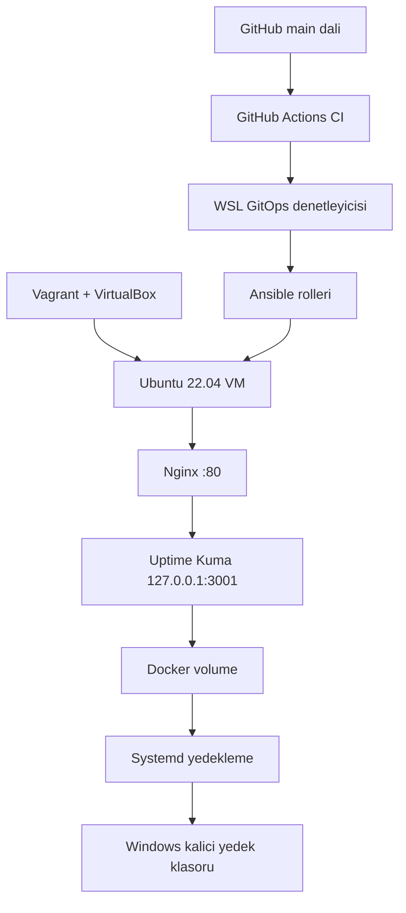

# GitOps & IaC Lab — Uptime Kuma

Vagrant, Ansible, Docker ve pull tabanli GitOps kullanarak yerel bir Ubuntu
sunucusunu koddan olusturan; Uptime Kuma'yi guvenli bicimde yayinlayan,
degisiklikleri otomatik dagitan ve VM silinse bile uygulama verisini yedekten
geri getiren bir altyapi otomasyonu projesi.

> Projenin IaC, guvenlik, CI, GitOps, self-healing, yedekleme ve felaket
> kurtarma akislari uygulanmis ve gercek senaryolarla dogrulanmistir.

## Projenin amaci

Bu laboratuvar asagidaki sureci otomatiklestirir:

1. Vagrant ve VirtualBox ile sabit IP'li Ubuntu VM olusturulur.
2. Ansible rolleri temel paketleri, Docker, Nginx ve guvenlik bilesenlerini kurar.
3. Uptime Kuma Docker Compose ile calistirilir.
4. Uygulama portu disariya acilmaz; erisim Nginx uzerinden saglanir.
5. Uptime Kuma verisi yerel Docker volume icinde tutulur.
6. Duzenli yedekler Windows tarafindaki kalici klasore yazilir.
7. GitHub Actions, altyapi kodunu merge edilmeden once dogrular.
8. WSL'deki GitOps denetleyicisi `main` dalini takip ederek yeni commit'leri
   otomatik uygular.
9. Servis sagliksizsa commit degismese bile istenen durum yeniden uygulanir.
10. VM silinip yeniden olusturuldugunda altyapi ve veriler otomatik geri gelir.

## Mimari



GitHub sunucuya baglanti baslatmaz. WSL'deki denetleyici GitHub'i periyodik
olarak kontrol eder; bu nedenle model **pull tabanlidir**.

## Kullanilan teknolojiler

- Vagrant ve VirtualBox
- Ubuntu 22.04 LTS
- WSL 2
- Ansible ve rol tabanli yapilandirma
- Docker Engine ve Docker Compose
- Uptime Kuma 2.5.0
- Nginx reverse proxy
- UFW ve Fail2ban
- Unattended Upgrades
- Systemd service ve timer
- GitHub Actions
- Pull tabanli GitOps ve self-healing

## Dizin yapisi

```text
gitops-iac-project/
├── .github/
│   └── workflows/
│       └── ci.yml
├── ansible/
│   ├── controller.yml
│   ├── inventory.ini
│   ├── keys/
│   │   └── gitops_iac_vagrant.pub
│   ├── roles/
│   │   ├── common/
│   │   ├── docker/
│   │   ├── gitops_controller/
│   │   ├── nginx/
│   │   ├── security/
│   │   └── uptime_kuma/
│   └── site.yml
├── docs/
│   └── gitops-controller.md
├── persistent/
│   ├── .gitignore
│   └── uptime-kuma-backups/
├── uptime-kuma/
│   └── compose.yaml
├── .gitignore
├── README.md
└── Vagrantfile
```

Ozel SSH anahtari, Uptime Kuma yedekleri ve Vagrant'in yerel durum dosyalari
Git'e eklenmez.

## On kosullar

Windows tarafinda:

- Windows 11
- VirtualBox
- Vagrant
- WSL 2 ve Ubuntu

WSL tarafinda:

- Ansible
- Git
- GitHub CLI (`gh`)
- SSH istemcisi

Gerekli Ansible koleksiyonu:

```bash
ansible-galaxy collection install community.general
```

## SSH anahtarini hazirlama

Depoda yalnizca acik anahtar bulunur. Ozel anahtar GitHub'a yuklenmemelidir.

```bash
ssh-keygen -t ed25519 \
  -f ~/.ssh/gitops_iac_vagrant \
  -C "gitops-iac-vagrant"

cp ~/.ssh/gitops_iac_vagrant.pub \
  /mnt/c/dev/gitops-iac-project/ansible/keys/gitops_iac_vagrant.pub
```

`ansible/inventory.ini` icindeki `ansible_ssh_private_key_file` degerinin kendi
WSL kullanici yolunuzu gosterdigini dogrulayin.

## Ilk kurulum

### 1. VM'yi olusturun

PowerShell'de:

```powershell
cd C:\dev\gitops-iac-project
vagrant up
vagrant status
vagrant ssh -c "echo SSH_OK"
```

### 2. SSH baglantisini dogrulayin

Ayni IP daha once baska bir VM tarafindan kullanildiysa eski parmak izini
temizleyin ve yeni kimligi kaydedin:

```bash
ssh-keygen -f ~/.ssh/known_hosts -R 192.168.56.10
ssh-keyscan -H 192.168.56.10 >> ~/.ssh/known_hosts

cd /mnt/c/dev/gitops-iac-project/ansible
ansible servers -i inventory.ini -m ping
```

Beklenen sonuc `ping: pong` degeridir.

### 3. Ilk altyapi dagitimini yapin

```bash
cd /mnt/c/dev/gitops-iac-project/ansible
ansible-playbook -i inventory.ini site.yml --syntax-check
ansible-playbook -i inventory.ini site.yml
```

Uptime Kuma:

```text
http://192.168.56.10
```

## Rol tabanli Ansible yapisi

| Rol | Sorumluluk |
|---|---|
| `common` | Kalici DNS, SSH ve temel paketler |
| `docker` | Docker deposu, paketleri ve servis durumu |
| `nginx` | Web sunucusu ve reverse proxy |
| `security` | UFW, Fail2ban ve otomatik guvenlik guncellemeleri |
| `uptime_kuma` | Volume, geri yukleme, Compose ve yedekleme |
| `gitops_controller` | WSL'deki pull tabanli dagitim denetleyicisi |

Ayni playbook tekrar calistirildiginda hedef sonuc:

```text
changed=0
failed=0
```

## Guvenlik modeli

| Bilesen | Yapilandirma |
|---|---|
| SSH | TCP 22 acik ve anahtar tabanli erisim |
| HTTP | TCP 80 acik |
| Uptime Kuma | Yalnizca `127.0.0.1:3001` uzerinde |
| Diger gelen trafik | UFW tarafindan reddedilir |
| SSH saldiri korumasi | Fail2ban `sshd` jail |
| Guvenlik guncellemeleri | Unattended Upgrades |
| Container yetkisi | `no-new-privileges` |
| GitHub erisimi | Pull modeli; disaridan sunucuya baglanti yok |
| SSH sunucu kimligi | GitOps'a ozel `known_hosts` dosyasi ve strict checking |

Kontrol:

```bash
curl -I http://192.168.56.10
curl --connect-timeout 3 http://192.168.56.10:3001
```

Ilk komut `200` veya `302`, ikinci komut baglanti hatasi vermelidir.

## GitHub Actions CI

Pull request ve `main` push islemlerinde `Infrastructure CI` workflow'u sunlari
dogrular:

- YAML bicimi (`yamllint`)
- Ansible playbook syntax'i
- Ansible lint kurallari
- Docker Compose yapisi
- Vagrantfile Ruby syntax'i

Yalnizca CI'dan gecen PR'lar `main` dalina birlestirilir.

## Pull tabanli GitOps

WSL'deki systemd timer yaklasik dakikada bir GitHub `main` dalini kontrol eder.
Yeni commit bulundugunda:

1. Commit'in izole bir kopyasi olusturulur.
2. Ansible syntax kontrolu yapilir.
3. `ansible/site.yml` uygulanir.
4. Uptime Kuma saglik kontrolu yapilir.
5. Basarili commit SHA'si durum dosyasina yazilir.

```bash
systemctl status gitops-deploy.timer --no-pager
sudo journalctl -u gitops-deploy.service -n 100 --no-pager
sudo cat /var/lib/gitops-controller/last-successful-commit
```

Ayrintili kurulum ve isletim bilgisi:
[docs/gitops-controller.md](docs/gitops-controller.md)

## Self-healing

Commit degismese bile Uptime Kuma sagliksizsa denetleyici Ansible'i yeniden
uygular. Bu davranis container elle durdurularak dogrulanmistir:

```bash
ansible servers -i ansible/inventory.ini -b \
  -m command -a "docker stop uptime-kuma"
```

Bir sonraki GitOps dongusunde container yeniden baslatilir ve HTTP saglik
kontrolu tekrar basarili olur.

## Kalici DNS

VM'nin DHCP tarafindan aldigi DNS sunucusu erisilemez olsa bile altyapi,
`systemd-resolved` drop-in dosyasiyla belirlenen DNS sunucularini kullanir:

```text
/etc/systemd/resolved.conf.d/99-gitops-dns.conf
```

Bu ayar VM yeniden baslatildiginda korunur ve Docker container'larinin alan
adlarini cozebilmesini saglar.

```bash
resolvectl query example.com
docker exec uptime-kuma getent hosts example.com
```

## Yedekleme ve geri yukleme

Canli Uptime Kuma verisi `uptime-kuma-data` Docker volume'unda tutulur. Windows
paylasimli klasoru canli SQLite veritabani icin degil, sikistirilmis yedekler
icin kullanilir.

Yedekleme timer'i her gun yaklasik 00:00, 06:00, 12:00 ve 18:00 saatlerinde
calisir. `RandomizedDelaySec=5m` nedeniyle baslangic birkac dakika degisebilir.

```bash
cd /mnt/c/dev/gitops-iac-project/ansible

ansible servers -i inventory.ini -b \
  -m command -a "/usr/local/sbin/backup-uptime-kuma"

tar -tzf \
  /mnt/c/dev/gitops-iac-project/persistent/uptime-kuma-backups/uptime-kuma-latest.tar.gz \
  | grep -E '(^|/)kuma\.db$'
```

Normal `vagrant destroy` isleminden once son yedek otomatik alinir. Yedekleme
basarisiz olursa VM'nin silinmesi durdurulur.

## Otomatik felaket kurtarma testi

Test edilen senaryo:

1. Uptime Kuma'da yonetici hesabi ve `TEST` monitoru olusturuldu.
2. Yedegin `kuma.db` icerdigi dogrulandi.
3. VM `vagrant destroy` ile tamamen silindi.
4. `vagrant up` ile bos bir VM olusturuldu.
5. WSL GitOps denetleyicisi servisin sagliksiz oldugunu algiladi.
6. Ansible tum altyapiyi yeniden kurdu.
7. Docker volume yedekten otomatik geri yuklendi.
8. Eski hesap, monitor ve olay gecmisi geri geldi.
9. Uptime Kuma yeniden `HTTP 302` ve `200 - OK` verdi.

Bu asamada elle `ansible-playbook` calistirilmadi; kurtarma pull tabanli GitOps
tarafindan gerceklestirildi.

## Dogrulanan sonuclar

- VM sifirdan basariyla olusturuldu.
- Ansible rolleri kurulumu hatasiz tamamladi.
- Idempotence testinde `changed=0 failed=0` elde edildi.
- Uptime Kuma yalnizca Nginx uzerinden erisilebilir durumda.
- Yedek icinde `kuma.db` dogrulandi.
- VM silinip yeniden olusturulduktan sonra eski hesap ve monitor geri geldi.
- CI kontrolleri PR akisi icinde basariyla calisti.
- Merge edilen commit GitOps tarafindan otomatik dagitildi.
- Durdurulan container self-healing ile yeniden baslatildi.
- VM ve container DNS cozumlemesi kalici hale getirildi.

## Sinirlar

- Bu proje yerel laboratuvar ortamidir; internete acik production sunucusu degildir.
- HTTP kullanilir; alan adi ve TLS/HTTPS henuz yapilandirilmamistir.
- GitOps denetleyicisinin calismasi icin Windows ve WSL acik olmalidir.
- Yedekler ayni fiziksel bilgisayarda tutulur; harici/off-site yedek yoktur.

## Yol haritasi

- [x] Vagrant ile tekrarlanabilir VM
- [x] Rol tabanli Ansible yapilandirmasi
- [x] Docker Compose ile Uptime Kuma
- [x] Nginx reverse proxy
- [x] UFW, Fail2ban ve otomatik guvenlik guncellemeleri
- [x] Otomatik yedekleme ve geri yukleme
- [x] Idempotence testi
- [x] GitHub Actions altyapi kontrolleri
- [x] Pull tabanli otomatik GitOps dagitimi
- [x] Self-healing testi
- [x] VM silme ve otomatik felaket kurtarma testi
- [x] Kalici VM ve container DNS yapilandirmasi
- [ ] Alan adi ve HTTPS/TLS
- [ ] Harici/off-site yedekleme
- [ ] Production sunucu uyarlamasi

## Lisans

Bu proje egitim ve laboratuvar amaciyla hazirlanmistir.
