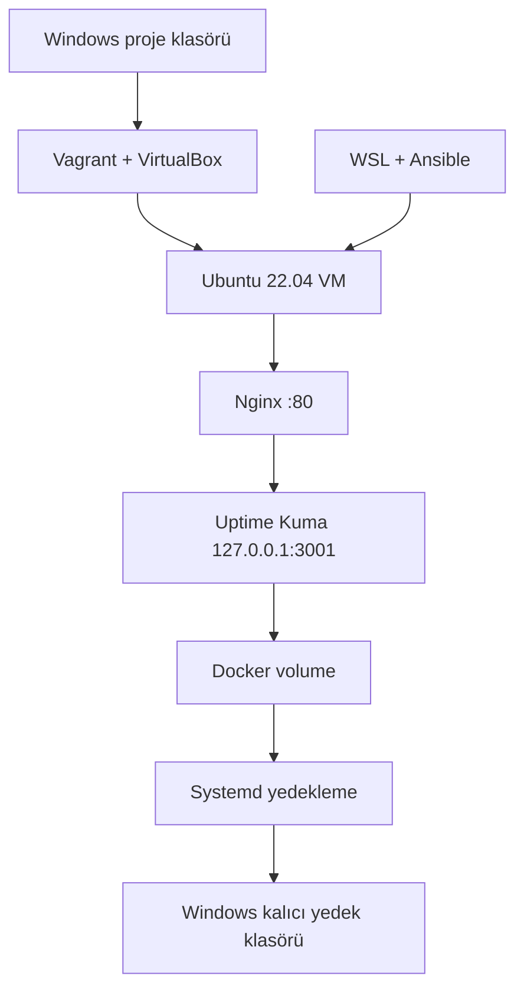

# GitOps & IaC Lab — Uptime Kuma

Vagrant, Ansible ve Docker kullanarak yerel bir Ubuntu sunucusunu koddan oluşturan; Uptime Kuma'yı güvenli biçimde yayınlayan ve VM silinse bile uygulama verisini yedekten geri getiren bir altyapı otomasyonu projesi.

> Projenin IaC, güvenlik, yedekleme ve felaket kurtarma aşamaları tamamlandı. GitHub Actions ve değişikliklerin sunucuya otomatik dağıtılması sonraki aşamadır.

## Projenin amacı

Bu laboratuvar aşağıdaki senaryoyu otomatikleştirir:

1. Vagrant ve VirtualBox ile Ubuntu VM oluşturulur.
2. Ansible; Docker, Nginx ve güvenlik bileşenlerini kurar.
3. Uptime Kuma, Docker Compose ile çalıştırılır.
4. Uygulama portu dışarı açılmaz; erişim Nginx üzerinden sağlanır.
5. Uptime Kuma verisi Docker volume içinde çalışır.
6. Düzenli yedekler Windows tarafındaki kalıcı klasöre yazılır.
7. VM silinip yeniden oluşturulduğunda Ansible yedeği otomatik geri yükler.

## Mimari



## Kullanılan teknolojiler

- Vagrant ve VirtualBox
- Ubuntu 22.04 LTS
- Ansible
- Docker Engine ve Docker Compose
- Uptime Kuma 2.5.0
- Nginx reverse proxy
- UFW ve Fail2ban
- Unattended Upgrades
- Systemd service ve timer

## Dizin yapısı

```text
gitops-iac-project/
├── Vagrantfile
├── ansible/
│   ├── inventory.ini
│   ├── keys/
│   │   └── gitops_iac_vagrant.pub
│   └── site.yml
├── persistent/
│   ├── .gitignore
│   └── uptime-kuma-backups/
└── uptime-kuma/
    └── compose.yaml
```

Özel SSH anahtarı ve Uptime Kuma yedekleri Git'e eklenmez.

## Ön koşullar

Windows tarafında:

- Windows 11
- VirtualBox
- Vagrant
- WSL 2 ve Ubuntu

WSL tarafında:

- Ansible
- Git
- SSH istemcisi

Ansible playbook'u `community.general` koleksiyonundaki UFW modülünü kullanır:

```bash
ansible-galaxy collection install community.general
```

## SSH anahtarını hazırlama

Depoda yalnızca açık anahtar bulunur. Özel anahtar hiçbir zaman GitHub'a yüklenmemelidir.

WSL'de yeni bir anahtar oluşturmak için:

```bash
ssh-keygen -t ed25519 \
  -f ~/.ssh/gitops_iac_vagrant \
  -C "gitops-iac-vagrant"
```

Oluşan açık anahtarı projeye kopyalayın:

```bash
cp ~/.ssh/gitops_iac_vagrant.pub \
  /mnt/c/dev/gitops-iac-project/ansible/keys/gitops_iac_vagrant.pub
```

`ansible/inventory.ini` içindeki `ansible_ssh_private_key_file` değerinin kendi WSL kullanıcı yolunuzu gösterdiğini doğrulayın.

## Kurulum

### 1. VM'yi oluşturun

PowerShell'de:

```powershell
cd C:\dev\gitops-iac-project
vagrant up
```

VM'nin hazır olduğunu doğrulayın:

```powershell
vagrant status
vagrant ssh -c "echo SSH_OK"
```

### 2. Eski SSH parmak izini temizleyin

Aynı IP ile daha önce başka bir VM kullanıldıysa WSL'de:

```bash
ssh-keygen -f ~/.ssh/known_hosts -R 192.168.56.10
```

### 3. Ansible bağlantısını test edin

```bash
cd /mnt/c/dev/gitops-iac-project/ansible
ansible servers -i inventory.ini -m ping
```

Beklenen sonuç:

```text
gitops-server | SUCCESS =>
    "ping": "pong"
```

### 4. Playbook'u çalıştırın

```bash
ansible-playbook -i inventory.ini site.yml --syntax-check
ansible-playbook -i inventory.ini site.yml
```

Kurulum tamamlandığında tarayıcıdan aşağıdaki adrese gidin:

```text
http://192.168.56.10
```

## Güvenlik modeli

| Bileşen | Yapılandırma |
|---|---|
| SSH | TCP 22 açık |
| HTTP | TCP 80 açık |
| Uptime Kuma | Yalnızca `127.0.0.1:3001` üzerinde |
| Diğer gelen trafik | UFW tarafından reddedilir |
| SSH saldırı koruması | Fail2ban `sshd` jail |
| Güvenlik güncellemeleri | Unattended Upgrades |
| Container yetkisi | `no-new-privileges` |

Uptime Kuma'ya doğrudan `192.168.56.10:3001` üzerinden erişilemez. Dış istekler port 80'deki Nginx'e gelir ve Nginx isteği VM içindeki Uptime Kuma'ya aktarır.

Kontrol:

```bash
curl -I http://192.168.56.10
curl --connect-timeout 3 http://192.168.56.10:3001
```

İlk komut `200` veya `302`, ikinci komut bağlantı hatası vermelidir.

## Yedekleme ve geri yükleme

Canlı Uptime Kuma verisi `uptime-kuma-data` adlı Docker volume içinde tutulur. Windows paylaşımlı klasörü canlı SQLite veritabanı için değil, sıkıştırılmış yedekler için kullanılır.

Yedekleme zamanlayıcısı her gün yaklaşık olarak 00:00, 06:00, 12:00 ve 18:00 saatlerinde çalışır. `RandomizedDelaySec=5m` nedeniyle başlangıç birkaç dakika değişebilir.

Manuel yedek almak için:

```bash
ansible servers -i inventory.ini -b \
  -m command -a "/usr/local/sbin/backup-uptime-kuma"
```

Yedek içeriğini doğrulamak için:

```bash
tar -tzf \
  /mnt/c/dev/gitops-iac-project/persistent/uptime-kuma-backups/uptime-kuma-latest.tar.gz \
  | grep -E '(^|/)kuma\.db$'
```

Normal `vagrant destroy` işleminden önce son yedek otomatik alınır. Yedekleme başarısız olursa VM'nin silinmesi durdurulur.

## Felaket kurtarma testi

1. Uptime Kuma'da yönetici hesabı ve test monitörü oluşturun.
2. Manuel yedek alın ve `kuma.db` dosyasını doğrulayın.
3. PowerShell'de VM'yi silip yeniden oluşturun:

```powershell
cd C:\dev\gitops-iac-project
vagrant destroy
vagrant up
```

4. WSL'de eski SSH parmak izini temizleyin ve playbook'u çalıştırın:

```bash
ssh-keygen -f ~/.ssh/known_hosts -R 192.168.56.10
cd /mnt/c/dev/gitops-iac-project/ansible
ansible-playbook -i inventory.ini site.yml
```

Volume boş ve yedek mevcutsa Ansible veriyi otomatik geri yükler. Uptime Kuma açıldığında eski hesabın ve test monitörünün görünmesi beklenir.

## İdempotence testi

Playbook'u değişiklik yapmadan ikinci kez çalıştırın:

```bash
ansible-playbook -i inventory.ini site.yml
```

Hedef sonuç:

```text
changed=0
failed=0
```

Bu sonuç, altyapının aynı playbook tekrar çalıştırıldığında gereksiz değişiklik üretmediğini gösterir.

## Doğrulanan sonuçlar

- VM sıfırdan başarıyla oluşturuldu.
- Ansible kurulumu hatasız tamamladı.
- İkinci playbook çalıştırmasında `changed=0 failed=0` elde edildi.
- Uptime Kuma yalnızca Nginx üzerinden erişilebilir durumda.
- Yedek içinde `kuma.db` doğrulandı.
- VM silinip yeniden oluşturulduktan sonra eski hesap ve test monitörü geri geldi.

## Yol haritası

- [x] Vagrant ile tekrarlanabilir VM
- [x] Ansible ile sunucu yapılandırması
- [x] Docker Compose ile Uptime Kuma
- [x] Nginx reverse proxy
- [x] UFW, Fail2ban ve otomatik güvenlik güncellemeleri
- [x] Otomatik yedekleme ve geri yükleme
- [x] VM silme ve felaket kurtarma testi
- [x] İdempotence testi
- [ ] Ansible kodunu role yapısına ayırma
- [ ] GitHub Actions ile YAML ve Ansible kontrolleri
- [ ] Git değişikliklerinin sunucuya otomatik dağıtılması
- [ ] HTTPS ve alan adı desteği

## Proje durumu

Bu depo şu anda tekrarlanabilir altyapı kurulumu ve kalıcı veri kurtarma sağlayan çalışan bir IaC laboratuvarıdır. Tam GitOps akışı, GitHub Actions ve otomatik dağıtım aşamalarının eklenmesiyle tamamlanacaktır.
